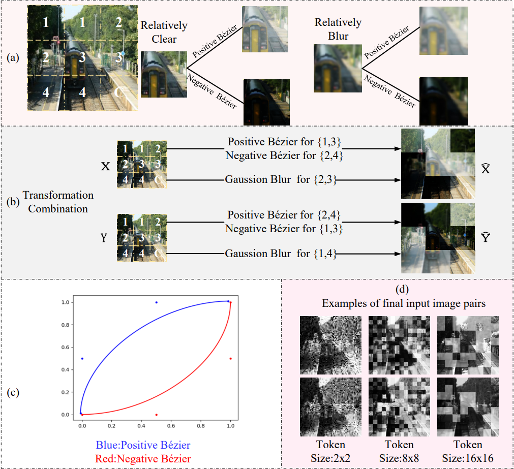
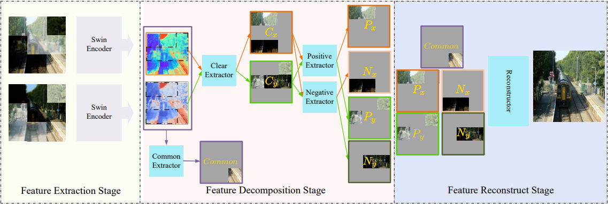

# DDBFusion
The official implementation of “DDBFusion: An unified image decomposition and fusion framework based on dual decomposition and B ́ezier curves”. 
And the code will be released soon. Imformation Fusion 2025.

Results of DDBFusion: 
Link：https://pan.baidu.com/s/1W44qyFggzTllKSQnJk4iGQ 
Code：y5z7

Citation：{
Zeyang Zhang, Hui Li, Tianyang Xu, Xiao-Jun Wu, Josef Kittler,
DDBFusion: An unified image decomposition and fusion framework based on dual decomposition and Bézier curves,
Information Fusion,
Volume 114,
2025,
102655,
ISSN 1566-2535,
https://doi.org/10.1016/j.inffus.2024.102655.
}
